# NurseSync — System Design Document

> **Version:** 1.0  
> **Last Updated:** 2026-02-21  
> **Package:** `exceptionallybad.nursesync`

---

## 1. Vision & Problem Statement

Nurses spend **30–40 %** of shift time on manual documentation. NurseSync lets a nurse simply *talk to the phone* after every clinical event and automatically produces structured, auditable medical logs — ready for handoff, discharge summaries, and regulatory compliance.

### Core Value Propositions

| Stakeholder | Pain Point | NurseSync Solution |
|---|---|---|
| Bedside Nurse | Tedious charting | Voice-first logging with structured output |
| Incoming Nurse (Handoff) | Incomplete verbal reports | Audio-backed, prioritised task summary |
| Discharge Team | Time-consuming summary creation | Auto-generated discharge log from shift data |
| Hospital Admin | Compliance & audit risk | Confidence-scored, prescription-matched logs |

---

## 2. High-Level Architecture


### Key Design Decisions

| Decision | Choice | Rationale |
|---|---|---|
| **UI Framework** | Jetpack Compose Multiplatform 1.10 | Single codebase for Android & iOS UI |
| **Language** | Kotlin 2.3.0 | KMP native, coroutine-first |
| **Architecture** | MVVM + Clean Architecture | Testable, separation of concerns |
| **Local DB** | Room Multiplatform (preferred) or SQLDelight | Cross-platform local persistence |
| **Networking** | Ktor Client | KMP-native HTTP client |
| **DI** | Koin | Lightweight, KMP-compatible |
| **Navigation** | Compose Navigation (Voyager or Decompose) | Type-safe, lifecycle-aware |
| **Audio** | Platform `expect/actual` (MediaRecorder / AVAudioRecorder) | Platform-native APIs |
| **STT** | Platform `expect/actual` (SpeechRecognizer / SFSpeechRecognizer) | On-device, low-latency |
| **Serialization** | kotlinx.serialization | KMP-native JSON |

---

## 3. Module Breakdown

### 3.1 Source Set Layout

```
composeApp/src/
├── commonMain/kotlin/exceptionallybad/nursesync/
│   ├── app/                    # App.kt, Theme, NavGraph
│   ├── core/
│   │   ├── di/                 # Koin modules
│   │   ├── network/            # Ktor client, ApiService
│   │   ├── database/           # Room/SQLDelight DAOs
│   │   └── util/               # Extensions, constants
│   ├── domain/
│   │   ├── model/              # Domain entities (Patient, LogEntry, Shift…)
│   │   ├── repository/         # Repository interfaces
│   │   └── usecase/            # Business-logic use cases
│   ├── data/
│   │   ├── repository/         # Repository implementations
│   │   ├── local/              # Local data sources
│   │   ├── remote/             # Remote data sources / DTOs
│   │   └── mapper/             # DTO ↔ Domain mappers
│   └── feature/
│       ├── auth/               # Login / Role selection
│       ├── dashboard/          # Home / Shift overview
│       ├── voicelog/           # Audio recording + transcription
│       ├── logentry/           # Manual log editing / review
│       ├── handoff/            # Shift handoff summary
│       ├── discharge/          # Discharge summary generation
│       ├── prescription/       # Prescription upload & matching
│       ├── chat/               # AI chat assistant
│       ├── tasks/              # Task priority list
│       └── settings/           # Profile, language, preferences
├── androidMain/kotlin/exceptionallybad/nursesync/
│   ├── audio/                  # Android MediaRecorder impl
│   ├── stt/                    # Android SpeechRecognizer impl
│   └── di/                     # Android-specific Koin modules
├── iosMain/kotlin/exceptionallybad/nursesync/
│   ├── audio/                  # iOS AVAudioRecorder impl
│   ├── stt/                    # iOS SFSpeechRecognizer impl
│   └── di/                     # iOS-specific Koin modules
└── commonTest/
    └── kotlin/exceptionallybad/nursesync/
        ├── domain/usecase/     # Use case unit tests
        └── data/repository/    # Repository tests (fakes)
```

### 3.2 Feature Modules

| # | Feature | Screens | Description |
|---|---|---|---|
| 1 | **Auth** | Login, Role Select | PIN / biometric login, nurse vs. admin role |
| 2 | **Dashboard** | Home | Shift clock, active patients, quick-log FAB |
| 3 | **Voice Log** | Record, Review | Record audio → STT → structured log preview |
| 4 | **Log Entry** | List, Detail, Edit | View / edit transcribed & structured logs |
| 5 | **Handoff** | Summary, Audio | Shift-end summary + audio for next nurse |
| 6 | **Discharge** | Summary, Export | Auto-generated discharge documentation |
| 7 | **Prescription** | Upload, Match | OCR / upload Rx → match against logged meds |
| 8 | **Chat** | Conversation | AI assistant for clinical doubts |
| 9 | **Tasks** | Priority List | Overdue / flagged / high-priority actions |
| 10 | **Settings** | Profile, Language | Multilingual support, notification prefs |

---

## 4. Data Flow — Voice Logging (Primary Use Case)

```mermaid
sequenceDiagram
    participant N as Nurse
    participant UI as Compose UI
    participant VM as VoiceLogVM
    participant STT as STT Adapter
    participant REPO as LogRepository
    participant LLM as LLM Service
    participant DB as Local DB

    N->>UI: Tap FAB / "Hey NurseSync"
    UI->>VM: startRecording()
    VM->>STT: beginStreaming()
    N->>STT: "Gave 10mg paracetamol to Ishaan Bhalla at 10pm"
    STT-->>VM: RawTranscript + confidence

    alt confidence < threshold
        VM-->>UI: Flag for human review 🚩
    end

    VM->>UI: Show editable transcript
    N->>UI: Confirm / edit transcript
    UI->>VM: confirmLog(editedText)

    VM->>REPO: parseAndSave(transcript)
    REPO->>LLM: extractEntities(transcript)
    LLM-->>REPO: {patient, drug, dose, time, action}
    REPO->>DB: insert(LogEntry)
    REPO-->>VM: Result.Success
    VM-->>UI: ✅ Log saved
```



---

## 5. Domain Entities (Core Models)

```kotlin
// -- Shift --
data class Shift(
    val id: String,
    val nurseId: String,
    val wardId: String,
    val startTime: Instant,
    val endTime: Instant?,
    val status: ShiftStatus,            // ACTIVE, COMPLETED, HANDED_OFF
)

// -- Patient --
data class Patient(
    val id: String,
    val name: String,
    val bed: String,
    val ward: String,
    val admissionDate: Instant,
    val diagnosis: String,
    val prescriptions: List<Prescription>,
)

// -- LogEntry (the core unit) --
data class LogEntry(
    val id: String,
    val shiftId: String,
    val patientId: String,
    val timestamp: Instant,
    val rawTranscript: String,
    val editedTranscript: String?,
    val audioFilePath: String?,
    val structuredData: StructuredLogData,
    val confidenceScore: Float,         // 0.0–1.0
    val flaggedForReview: Boolean,
    val status: LogStatus,              // DRAFT, CONFIRMED, AMENDED
)

data class StructuredLogData(
    val action: ClinicalAction,         // MEDICATION, VITALS, DRESSING, OBSERVATION…
    val medication: MedicationInfo?,
    val vitals: VitalsInfo?,
    val notes: String?,
)

// -- Task (for priority handoff) --
data class Task(
    val id: String,
    val patientId: String,
    val description: String,
    val priority: TaskPriority,         // CRITICAL, HIGH, MEDIUM, LOW
    val dueBy: Instant?,
    val completed: Boolean,
    val sourceLogId: String?,           // Link back to the log that created it
)

// -- Prescription --
data class Prescription(
    val id: String,
    val patientId: String,
    val medication: String,
    val dosage: String,
    val frequency: String,
    val prescribedBy: String,
    val startDate: Instant,
    val endDate: Instant?,
)

// -- Handoff Summary --
data class HandoffSummary(
    val id: String,
    val outgoingShiftId: String,
    val incomingNurseId: String?,
    val generatedAt: Instant,
    val patientSummaries: List<PatientHandoffNote>,
    val pendingTasks: List<Task>,
    val audioSummaryPath: String?,
)
```

---

## 6. Network Layer


### API Contract (Future Backend)

| Endpoint | Method | Description |
|---|---|---|
| `/auth/login` | POST | Nurse login |
| `/shifts` | GET/POST | List / create shifts |
| `/shifts/{id}/logs` | GET/POST | Logs for a shift |
| `/logs/{id}` | PUT/DELETE | Update / delete a log |
| `/patients` | GET | Patient roster |
| `/patients/{id}/prescriptions` | GET | Prescriptions for matching |
| `/handoff` | POST | Generate handoff summary |
| `/discharge/{patientId}` | POST | Generate discharge summary |
| `/chat` | POST (streaming) | AI assistant chat |
| `/transcribe` | POST (multipart) | Server-side STT fallback |
| `/llm/extract` | POST | NER extraction from transcript |

---

## 7. Platform Abstractions (`expect/actual`)

| Capability | `expect` Interface (commonMain) | Android `actual` | iOS `actual` |
|---|---|---|---|
| Audio Recording | `AudioRecorder` | `MediaRecorder` | `AVAudioRecorder` |
| Speech-to-Text | `SpeechToText` | `SpeechRecognizer` | `SFSpeechRecognizer` |
| File Storage | `FileManager` | `Context.filesDir` | `NSFileManager` |
| Permissions | `PermissionHandler` | `ActivityResultLauncher` | `AVAudioSession` |
| Biometric Auth | `BiometricAuth` | `BiometricPrompt` | `LAContext` |
| Push Notifications | `PushNotifier` | `FCM` | `APNs` |
| TTS (for handoff playback) | `TextToSpeech` | `android.speech.tts` | `AVSpeechSynthesizer` |

---

## 8. Dependency Graph


> **Rule**: `domain` has ZERO platform dependencies. `feature` depends on `domain` and `data`, never directly on `core.network` or `core.database`.

---

## 9. Offline-First Strategy


- All log entries are saved locally **first**.
- A `SyncManager` (backed by WorkManager on Android / BGTaskScheduler on iOS) syncs queued operations.
- Conflict resolution: **Last-Write-Wins** with server timestamp, flagged for manual merge if needed.

---

## 10. Security & Compliance

| Concern | Approach |
|---|---|
| Data at rest | AES-256 encryption via platform keystore |
| Data in transit | TLS 1.3, certificate pinning |
| Auth | Token-based (JWT), refresh rotation |
| PHI (Protected Health Info) | No PHI in logs/analytics; local audio encrypted |
| Session timeout | Auto-lock after 5 min inactivity |
| Audit trail | Immutable append-only log with nurse ID + timestamp |
| HIPAA alignment | Minimum necessary data principle, access controls |

---

## 11. Multilingual Strategy

| Layer | Approach |
|---|---|
| UI Strings | Compose Resources (`composeResources/values-<lang>/strings.xml`) |
| STT Input | Language parameter passed to platform STT engine |
| LLM Processing | Language tag sent with transcript; LLM normalises to English structured data |
| Output | Structured data rendered in user's chosen locale |

Supported languages (Phase 1): **English, Hindi**. Extensible via resource bundles.

---

## 12. Confidence Scoring & Flagging

```
confidence = STT_confidence × LLM_extraction_confidence

if confidence < 0.70 → FLAG for human review
if confidence < 0.40 → REQUIRE manual confirmation before save
```

**Visual indicators:**
- 🟢 High (≥ 0.85) — Auto-confirmed
- 🟡 Medium (0.70–0.84) — Auto-saved, review suggested
- 🔴 Low (< 0.70) — Flagged, manual edit required

---

## 13. Prescription Matching

```mermaid
flowchart TD
    LOG[LogEntry: "10mg paracetamol"] --> EXTRACT[LLM Extract: drug=paracetamol, dose=10mg]
    RX[Prescription: paracetamol 500mg Q6H] --> MATCH{Match?}
    EXTRACT --> MATCH
    MATCH -->|Dose mismatch| ALERT["⚠️ Dose discrepancy alert"]
    MATCH -->|Match OK| CONFIRM["✅ Matches prescription"]
    MATCH -->|No Rx found| WARN["🔍 No prescription on file"]
```

---

## 14. Non-Functional Requirements

| Attribute | Target |
|---|---|
| App cold start | < 2 s |
| Voice log capture → save | < 5 s (on-device STT) |
| Offline capability | Full logging without network |
| Min Android | API 24 (Android 7.0) |
| Min iOS | iOS 16 |
| Audio format | AAC / m4a, max 5 min per clip |
| Local DB size budget | ~50 MB per 1000 logs + audio |
| Accessibility | TalkBack / VoiceOver, dynamic font |

---

## 15. Tech Stack Summary

| Layer | Library | Version |
|---|---|---|
| Language | Kotlin | 2.3.0 |
| UI | Compose Multiplatform | 1.10.0 |
| Material Design | Material 3 | 1.10.0-alpha05 |
| Navigation | Voyager / Compose Navigation | Latest |
| DI | Koin Multiplatform | 4.x |
| Networking | Ktor Client | 3.x |
| Local DB | Room Multiplatform / SQLDelight | Latest |
| Serialization | kotlinx.serialization | 1.7.x |
| Date/Time | kotlinx-datetime | 0.6.x |
| Image Loading | Coil 3 (Multiplatform) | 3.x |
| Async | kotlinx.coroutines | 1.9.x |
| Logging | Kermit | 2.x |
| Testing | kotlin.test, Turbine, MockK | Latest |

---

## 16. Phased Rollout

| Phase | Features | Timeline |
|---|---|---|
| **Phase 1 — MVP** | Auth, Dashboard, Voice Logging, Log Entry CRUD, Local storage | Weeks 1–3 |
| **Phase 2 — Handoff** | Handoff summary generation, Task prioritisation, Audio playback | Weeks 4–5 |
| **Phase 3 — Intelligence** | LLM integration, Prescription matching, Confidence scoring | Weeks 6–7 |
| **Phase 4 — Polish** | Discharge summaries, AI Chat, Multilingual, Push notifications | Weeks 8–10 |
